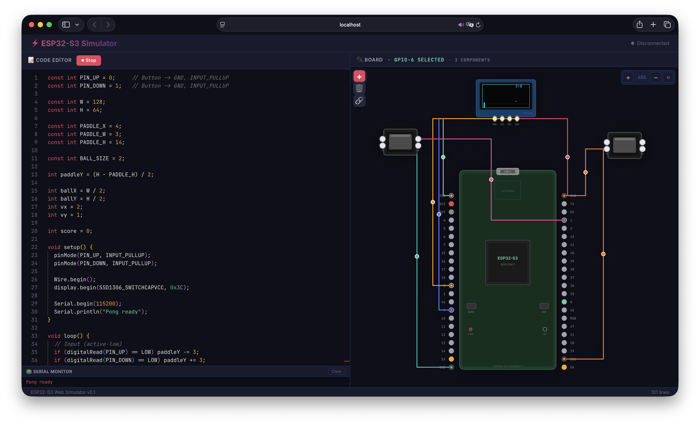

# ESP32-S3 Simulator (Web)

A web-based ESP32-S3 playground that lets you **write Arduino-style sketches**, **wire up virtual components**, and **run the simulation in your browser**. The repo also contains a Go backend with a WebSocket protocol and an Arduino compilation pipeline (via `arduino-cli`) that can be used for “real” firmware builds and future tighter hardware emulation.

## Preview



## What you get

- **In-browser Arduino runtime**: a lightweight Arduino C++ → JavaScript transpiler + runtime (no installs required to try it).
- **Interactive board UI**: place components, connect wires, and drive GPIO state.
- **Serial monitor**: view `Serial.println(...)` output produced by the simulation runtime.
- **Optional backend compiler**: Go service can compile sketches for ESP32-S3 using `arduino-cli` (auto-downloads `arduino-cli` if missing).
- **WebSocket protocol**: pin updates, serial output, status, and compile results.

## Repo layout

- `main.go`: Go entrypoint (HTTP server on `:8080`)
- `server/`: HTTP + WebSocket server (serves `frontend/dist` + `/ws`)
- `compiler/`: Arduino compilation helpers (downloads `arduino-cli`, installs ESP32 core, produces `.bin`)
- `simulator/`: backend-side GPIO state model (used by the server)
- `frontend/`: React + TypeScript + Vite UI (editor + board + JS simulation runtime)

## Quickstart (recommended: full-stack dev)

### Prerequisites

- **Go**: use the version from `go.mod`
- **Node.js**: 18+ (20+ recommended)
- **npm**: comes with Node (this repo includes `frontend/package-lock.json`)

### 1) Start the Go backend (port 8080)

From the repo root:

```bash
go run .
```

The server listens on `http://localhost:8080` and exposes a WebSocket at `/ws`.

### 2) Start the frontend dev server (port 5173)

In another terminal:

```bash
cd frontend
npm ci
npm run dev
```

Open `http://localhost:5173`.

Notes:
- Vite is configured to **proxy** `/ws` to the Go backend in development (`frontend/vite.config.ts`).
- The current UI primarily runs the **browser simulation** when you click “Upload & Run”.

## Production-ish run (single server)

The Go server serves static files from `frontend/dist`, so you can build the UI and then run only the Go binary.

```bash
cd frontend
npm ci
npm run build

cd ..
go run .
```

Then open `http://localhost:8080`.

## How the simulation works (high level)

There are two “tracks” in this repo:

### Track A — Browser simulation (today’s UI behavior)

The frontend includes:
- `frontend/src/simulator/transpiler.ts`: a small Arduino-ish transpiler (C++-like subset → JS)
- `frontend/src/simulator/runtime.ts`: an Arduino-style runtime that exposes APIs like GPIO, timing, Serial, etc.
- `frontend/src/hooks/useSimulation.ts`: runs the transpiled sketch, updates pins, serial, OLED buffer, and buzzer tone

When you click **Upload & Run**, the sketch is transpiled and executed in the browser via the runtime.

### Track B — Go backend + `arduino-cli` compile (available, evolving)

The Go backend exposes a WebSocket protocol (see below). When it receives `upload_code`, it can run `compiler.Compile(...)` which:
- resolves `arduino-cli` from PATH or auto-installs it to `~/.esp32-simulator/bin/`
- installs the ESP32 Arduino core if needed
- compiles the sketch for **ESP32-S3** and returns a `.bin` path

This is useful for firmware builds and future integration where the UI controls a “real compile” flow.

## WebSocket API (Go server)

Endpoint: `ws://<host>:8080/ws` (in dev, Vite proxies `/ws` to this backend).

### Client → Server messages

```json
{ "type": "upload_code", "code": "/* Arduino sketch */" }
```

```json
{ "type": "stop" }
```

```json
{ "type": "set_pin", "pin": 2, "state": "HIGH" }
```

```json
{ "type": "button_press", "pin": 0, "pressed": true }
```

### Server → Client messages

```json
{ "type": "pin_update", "pins": [ { "number": 2, "mode": "OUTPUT", "state": "HIGH" } ] }
```

```json
{ "type": "serial_output", "data": "Hello from ESP32-S3 Simulator!" }
```

```json
{ "type": "status", "running": true, "message": "Compiled successfully. Running sketch..." }
```

```json
{ "type": "compile_error", "error": "No code to compile" }
```

```json
{ "type": "compile_success", "binPath": "/tmp/esp32-sim-1234.bin" }
```

## Testing

### Go

```bash
go test ./...
```

Note: `compiler` tests are written to be CI-friendly and will log and return if `arduino-cli` or platform installs are unavailable.

### Frontend

```bash
cd frontend
npm test
```

## Troubleshooting

### WebSocket won’t connect

- Make sure the Go server is running on `:8080`.
- If you’re using the Vite dev server, confirm the proxy in `frontend/vite.config.ts` and use `http://localhost:5173`.
- If you open the Go-served app (`:8080`) behind HTTPS, the browser will require **secure WebSockets** (`wss://`). The frontend currently uses a `ws://` URL; for HTTPS deployments you’ll want to switch to relative WS URLs or `wss://` based on `window.location.protocol`.

### Compilation fails / `arduino-cli` issues

- First compile may take a while because the ESP32 core gets installed.
- The compiler will download `arduino-cli` automatically if it’s not on your PATH.
- If your environment blocks downloads, install `arduino-cli` yourself and ensure it’s available on PATH.

## Contributing

Issues and PRs are welcome.

- Keep changes focused and covered by tests where practical.
- Prefer small, composable pieces: UI components + hooks in `frontend/`, backend protocol and state in `server/` and `simulator/`.

## License

See `LICENSE`.

